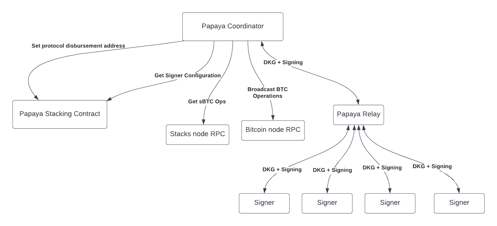
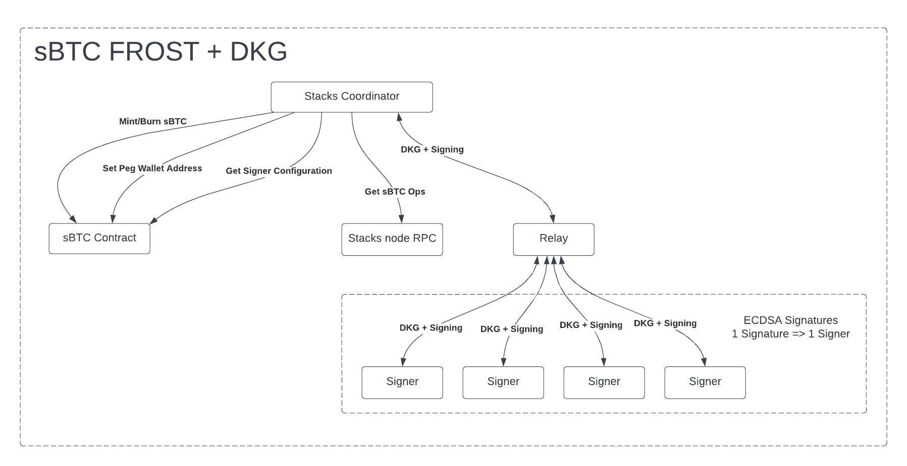
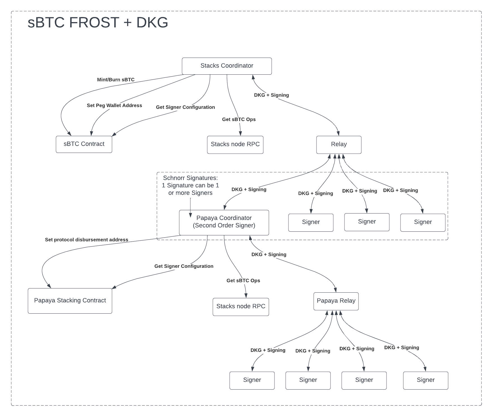

# Papaya | BOSS

The Papaya coordinator is the pivotal element within Papaya's Bitcoin Onboarding Script System. It undertakes the following primary roles: monitoring for sBTC Signing Operations, managing Papaya's PoX distribution wallet, managing STX and BTC fee wallets, and performing sBTC Peg-In on behalf of the protocol. To fulfill these tasks, the coordinator liaises with Papaya signers through a relay, acting as a second-order signer for sBTC Operations. It actively collaborates with the Papaya protocol contracts, defining the PoX reward distribution address, setting the signer configuration, and managing both BTC & STX wallets. These wallets are crucial in handling transaction fees, which form an integral part of the PoX reward distribution process.

## BOSS Architecture

In the rapidly evolving landscape of decentralized finance (DeFi), the integrity and resilience of systems play an essential role in maintaining trust and ensuring scalability. As Papaya explores the realm of Liquid Stacking and its integration with sBTC, it's crucial to emphasize the importance of architectural design, especially in terms of Papaya’s role as an sBTC Signer.

The sBTC ecosystem, a critical stakeholder in this conversation, maintains its security through the decentralization of stacking activities. Any considerable centralization, especially with a system like Papaya, could jeopardize the stability of the peg if not adequately designed.

Papaya's initiative to push for the adoption of Schnorr signatures in lieu of ECDSA for sBTC FROST network packets enables a promising solution to extend the composability of the sBTC system. With Schnorr signatures at the helm, protocols on stacks can achieve integration with the sBTC FROST+DKG architecture without posing centralization risks to the system. This framework stands as the cornerstone for Papaya’s trustless onboarding of sBTC from stacking rewards and our commitment to credible decentralization.

## Original sBTC FROST Architecture

Let's contemplate a couple of hypothetical scenarios:

- A situation where 100% of Stacking activity is monopolized by merely three custodial protocols.
- A more weighted scenario where a staggering 70% of the Total Value Locked (TVL) of STX in Stacking is held by a singular custodial Liquid Stacking protocol.

In these scenarios, centralization concerns loom large. The former situation raises questions about the number of signing entities and potential risks to the sBTC's foundational principles. The latter poses a genuine threat, with one entity potentially wielding undue control over the sBTC peg-wallet.

The essence lies not in the probability of these situations but in our system's preparedness to handle them. Embracing decentralized threshold signing strengthened by Schnorr signatures, enables a solution space to effectively tackle these challenges.

## Papaya’s proposed sBTC FROST+DKG architectural change

With Schnorr signatures, we can usher in a new era of seamless integration between liquid stacking protocols on stacks and the sBTC Peg wallet FROST+DKG architecture. This change enables robust solutions designed to address centralization concerns, thereby ensuring that signing responsibilities are not monopolized by a single entity.