# Business Use Cases Unlocked

This document outlines the potential business use cases that are generally enable by liquid stacking and liquid stacking derivatives.

# Individual/Trader

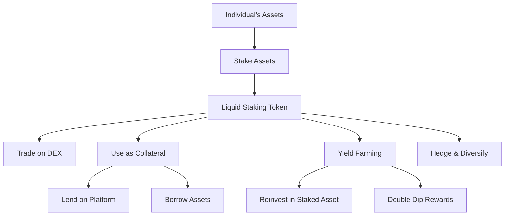

**Liquidity Provision**

Liquid staking allows individuals to stake their assets and still have access to the liquidity in the form of a tokenized staked asset. This can be traded, used as collateral, or utilized in other decentralized finance (DeFi) applications.

Individuals can use these tokenized staked assets to enter into other investment opportunities without having to unstake or sell their primary staked asset.

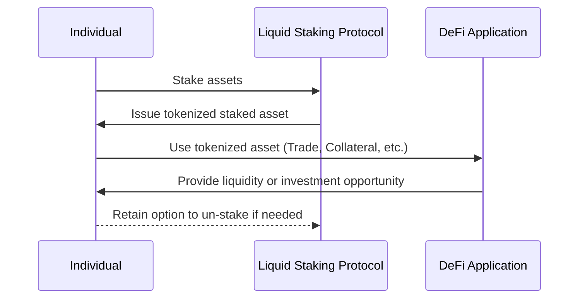

**Collateralization for loans**

Individuals can lend their tokenized staked assets on lending platforms to earn interest or use them as collateral to borrow other assets.

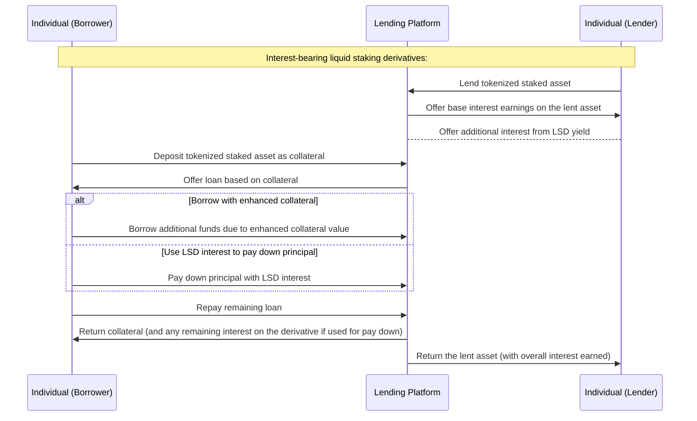

**Yield Farming**

Rewards earned from yield farming can be converted and reinvested into more of the original asset, which can then be staked again, creating a compounding effect.

By utilizing liquid staking derivatives in yield farming protocols, individuals can potentially earn additional rewards, effectively double-dipping.

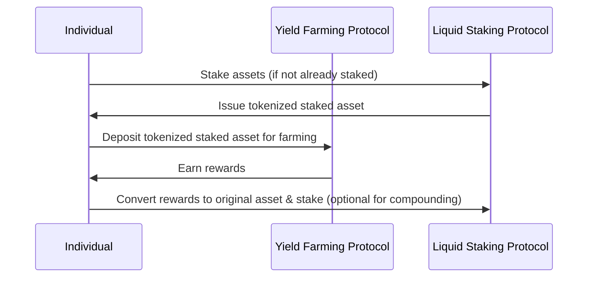

**Hedging and Risk Management**

With the tokenized form of staked assets, individuals and institutions can easily trade or diversify their holdings. If they foresee a potential downturn or risk in one staked asset, they can exchange it for another without waiting for un-staking periods.

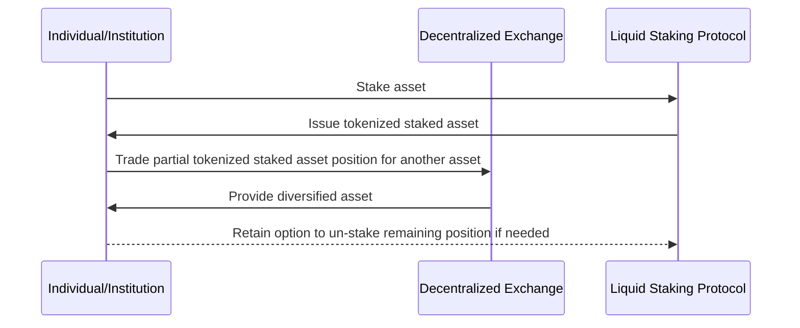

# Teams/Builders

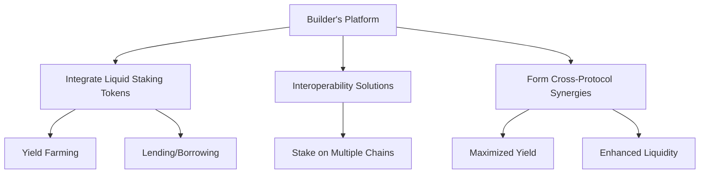

**DeFi Integration**:

Builders can integrate liquid staking tokens into their DeFi applications, expanding the range of assets available for yield farming, lending, borrowing, and other DeFi activities.

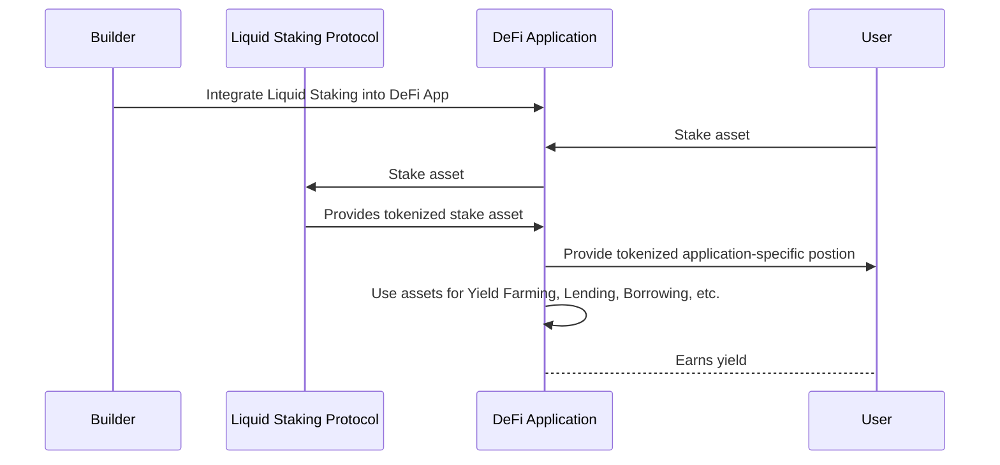

**Interoperability Solutions**:

Builders can explore interoperability solutions that enable cross-chain liquid staking, allowing users to stake assets across different blockchains.

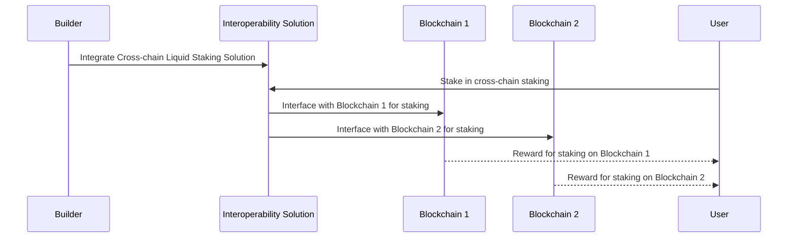

**Cross-Protocol Synergies**

Developers can create partnerships or integrations with other DeFi protocols, leveraging the liquid staked assets to maximize yield for users. For instance, integrating a liquid staking platform with a yield aggregator can optimize returns for users.

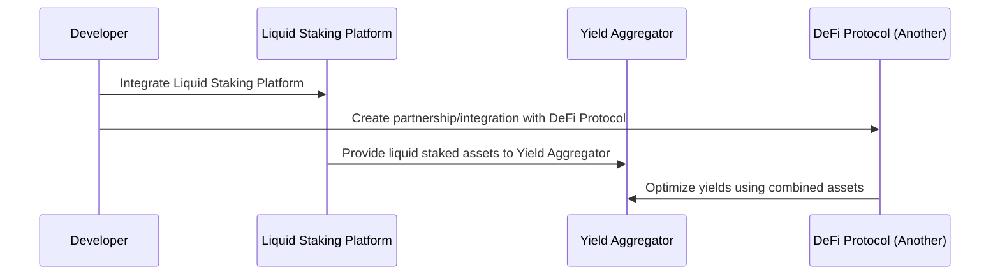

# Institutions

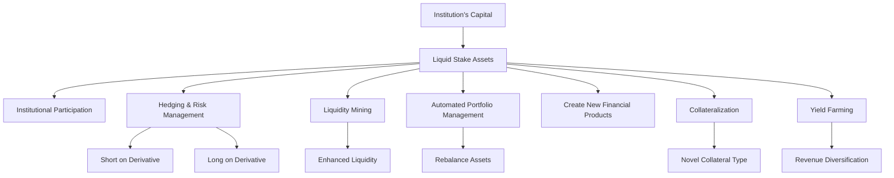

**Institutional Participation**

Liquid staking can offer a more attractive entry point for institutional investors. They can benefit from the potential rewards of staking while maintaining liquidity, which is often a requirement for institutional operations. (Looking at you, T-Bonds 👀)

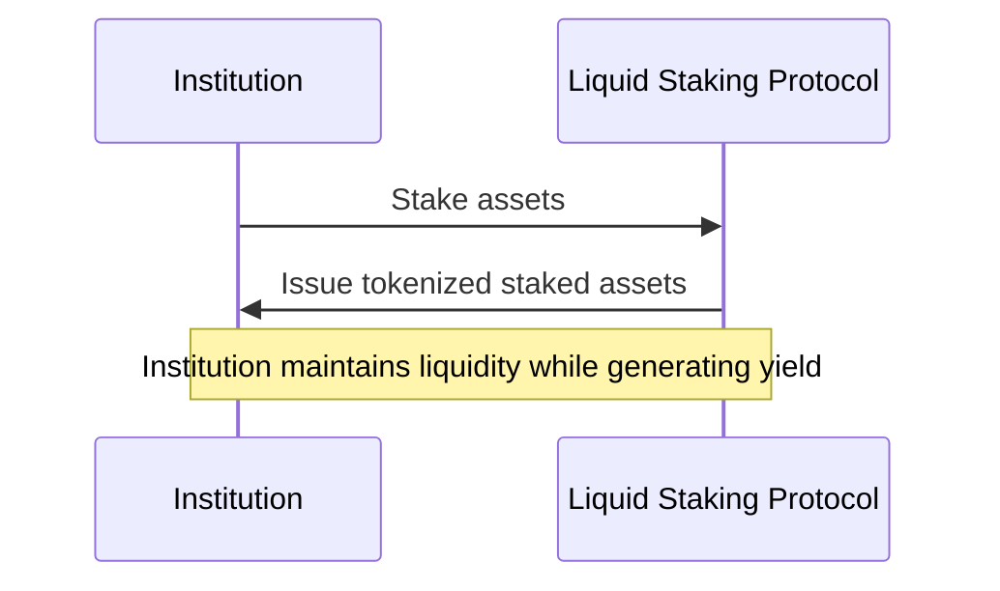

**Hedging and Risk Management**

With liquid staking derivatives available, it's possible for investors to hedge their positions. For instance, if one anticipates a decrease in rewards, they might take a short position on a liquid staking derivative. Conversely, if an investor expects the rewards to increase, they could take a long position on the derivative, thereby securing potential future gains.

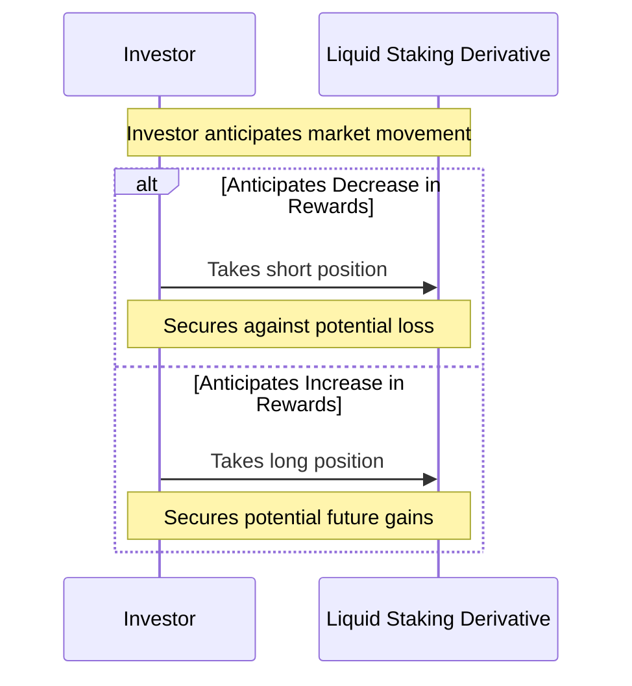

Suppose an investor has a long position in a certain asset, but they anticipate a potential decrease in its value. To hedge against this risk, they could use their liquid staking rewards to take a short position in a derivative of the same asset.

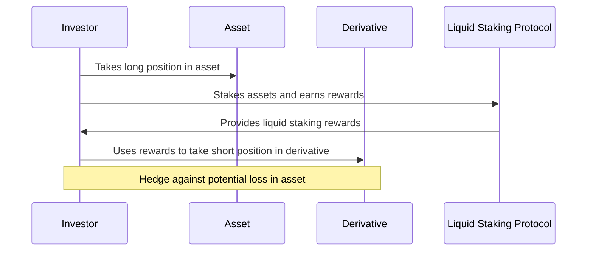

This way, if the asset's value decreases, the loss in the long position would be offset by the gain in the short position. Conversely, if the asset's value increases, the gain in the long position would offset the loss in the short position.

**Liquidity Mining**

Protocols can incentivize stakers by offering additional rewards for those who stake and then use their liquid staking tokens in specific DeFi platforms or liquidity pools. This dual reward mechanism (staking rewards + liquidity mining rewards) can attract more capital and ensure a deeper liquidity for the token.

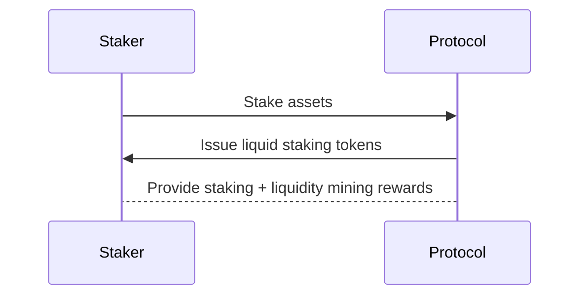

**Automated Portfolio Management**: 

With liquid staking tokens available, portfolio management tools could be build to automate certain strategies, like rebalancing between liquid assets and staking positions, to optimize returns

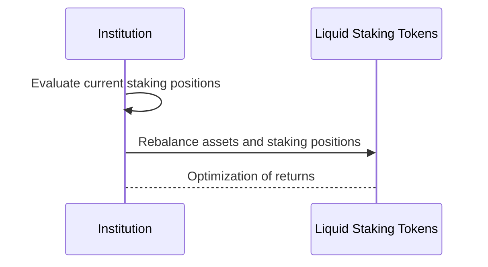

**New Financial Products**

Institutions can create new financial products around these tokenized staked assets, such as staking as a service, derivative products, or interest-bearing instruments.

**Collateralization**

For institutions dealing in DeFi lending and borrowing, tokenized staked assets can serve as a novel form of collateral, due to different risk-reward profiles compared to traditional assets.

**Yield Farming**

Institutions can diversify their revenue streams by not only earning from staking but also from yield farming using the tokenized staked assets. This can provide a competitive advantage in the DeFi landscape.

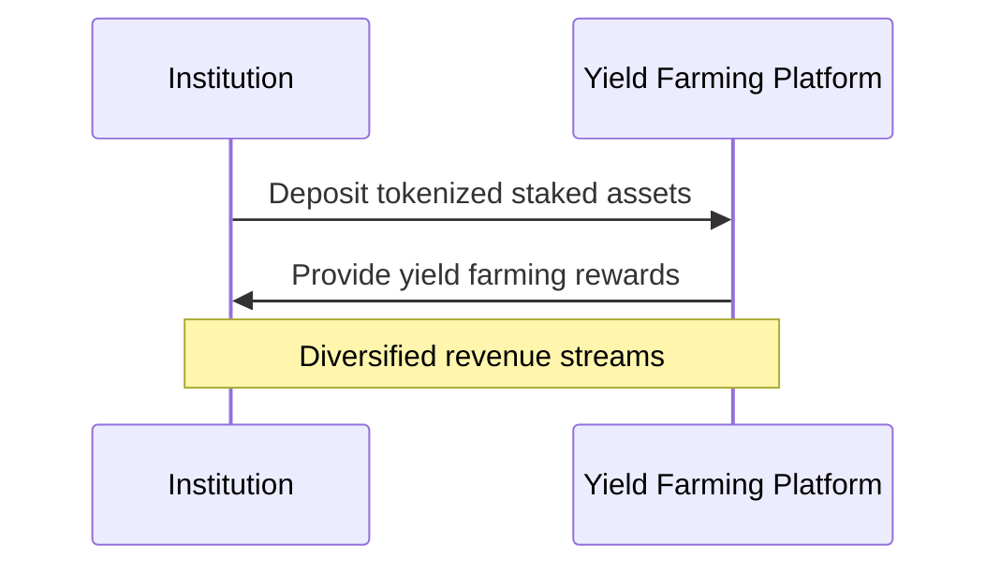
