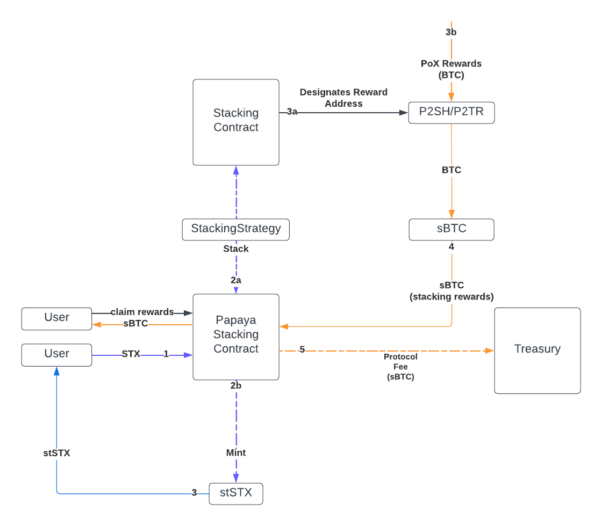

# Liquid STX Critical Bounty Whitepaper

# Papaya - A Liquid Staking Platform

### Authors

[Jake Krogman](https://twitter.com/dreadful_dev) 
[Aakanksha Mahajan](https://twitter.com/dev_supernova) 
[CiaraMaria Proia](https://twitter.com/themariaverse)
[Tim Varner](https://github.com/tavarner)

# Abstract

The upcoming release of sBTC on the Stacks blockchain presents a major opportunity to unlock Bitcoin's full potential as a programmable asset. This is especially appealing if you view Bitcoin as the world's largest reservoir of untapped liquidity. By introducing sBTC, a synthetic Bitcoin pegged to its value, Stacks enables seamless movement of Bitcoin assets in and out of smart contracts, opening up fresh possibilities for decentralized finance (DeFi) applications and Bitcoin-related use cases.

Our liquid staking module creates a protocol that simplifies stacking STX on Stacks by pooling users' funds and automatically onboarding BTC rewards as sBTC. The protocol provides users with stSTX tokens representing their staked STX and accrued rewards, enabling liquid staking and allowing users to use their stSTX tokens in other DeFi platforms while still being able to gain Stacking rewards and participate in securing the network through PoX.

# 1. Introduction

## 1.1. Background

Proof of Transfer (PoX) is the consensus mechanism used by the Stacks blockchain. PoX enables Stacks miners to mine new Stacks (STX) tokens by sending BTC to Stacking reward addresses, while STX holders lock (or "stack") their tokens to earn BTC rewards on the Bitcoin blockchain.

To simplify, the PoX process can be described in two main steps:

1. **Stacks Mining**: Miners compete to create new blocks on the Stacks blockchain by sending BTC to Stacking reward addresses. The miner is chosen via VRF based on their transferred BTC to mine the next block, which results in newly minted STX tokens as a reward.
2. **Stacking**: STX holders participate in the Stacking process by locking their STX tokens for a predetermined period of time. By doing so, they become eligible to receive BTC rewards proportional to the amount of STX they've stacked. These rewards are generated from the BTC sent by Stacks miners during the mining process.

## 1.2. Problem

*Participating in Stacking comes with a tradeoff:* the STX tokens used for Stacking become illiquid, as they are locked during the Stacking period. This means that the Stacked STX tokens cannot be sold or transferred until the lock-up period is over. While this may not be ideal for users who require immediate liquidity, the potential BTC rewards earned through Stacking can make the tradeoff worthwhile for many STX holders.

## 1.3 Solution

In contrast to “pure stacking”, Liquid Staking refers to a mechanism that allows users to stake their digital assets and receive a tokenized representation of their staked assets in return. This tokenized representation can then be used in various other DeFi applications, while the original assets remain locked and continues to earn stacking rewards. Liquid Staking combined with Stacking introduces unique and exciting opportunities in the Bitcoin DeFi space.

# 2. Liquid Staking Protocol

Below is the technical representation of our architecture for Liquid staking. We have implemented a clear separation between the stacking strategy and staking contracts, along with the use of active/migrating strategy variables to manage the state of the strategy contract throughout it’s lifecycle. This approach to our stacking mechanism prioritizes modularity, transparency, and dynamic interactions, ensuring a robust, user-friendly, and adaptable staking ecosystem. As DeFi continues to grow on stacks, this modularity will play a crucial role in Papaya’s maturation and adoption.

Technical Architecture Diagram for Liquid Staking 

Throughout this Whitepaper the terms Staking and Stacking are used.
Each term is defined as follows:

- **'Staking'** refers to users transferring tokens to Papaya in exchange for liquid representations of those tokens (e.g., STX for stSTX).
- **'Stacking'** means Papaya locks the combined STX holdings in the Stacks PoX contract to earn BTC rewards.

## 2.1 **Staking STX**

Modular UML Diagram: Stacking Contract

When a user decides to stake STX tokens within the Liquid Staking protocol, they’ll receive an equivalent amount of stSTX tokens, representing their staked STX. The protocol collects all the staked tokens from users and stacks these funds together to participate in the PoX consensus mechanism, which generates rewards in the form of BTC.

These BTC rewards are then sent to a Pay-to-Tap-Root (P2TR) address which is controlled by a FROST+DKG threshold signature wallet to automatically handle the conversion of BTC into sBTC on behalf of the protocol. sBTC represents a synthetic version of BTC, pegged to its value. These sBTC rewards are then distributed to users proportionally based on the amount of STX they have staked within that reward cycle in the form of stBTC (staked sBTC) tokens.

Users can request a withdrawal of their staked STX tokens anytime. If they make a withdrawal request during a PoX Stacking cycle, the protocol will unlock the tokens at the cycle's end to complete outstanding withdrawals. To claim their STX, users must transfer the stSTX tokens to the protocol, which will be burned only after the STX transfer to the user is confirmed on the blockchain.

## 2.2 Stacking Strategy

Modular UML Diagram: StackingStrategy Contract

Liquid Staking will utilize an integrated Custodial Stacking Contract and a Stacking Strategy Contract to enhance protocol stacking. The objective is to optimize protocol rewards by considering parameters such as cycle length, minimum stacking amount, withdrawals, and auto-unlocking potential.

*Why custodial?* Custody is required as part of the issuance of stSTX for STX. Although the original STX are technically not in the user's direct control, the Stacking Contract governs the terms, ensuring assets cannot be moved without meeting certain conditions and rewards are distributed algorithmically.

The Stacking Strategy contract is designed to be modular and upgradable to evolve with the Stacks network without affecting the Stacking Contract logic and security.

By default, the protocol stacks all STX tokens for 1 cycle at a time. Before the next cycle begins, the Stacking Strategy contract determines whether to extend stacking or unlock from PoX, initiating a cool down cycle during which withdrawal requests made by users can be fulfilled. As potential changes to PoX occur, or more optimal strategies are developed as the TVL of papaya grows, the modular Stacking Strategy contract gives papaya the ability to react accordingly.

## 2.3 Standardized Yield Token

Our Liquid Stacking module is drawing inspiration from Ethereum's EIP-5115 to build a Standard Yield token for the different use cases on our platform. The goal is to create a common framework for handling various yield-bearing assets and mechanisms, streamlining interoperability and simplifying DeFi development within the Stacks ecosystem. This token would be an extension to the SIP-010 standard, ensuring compatibility with existing platforms.

The Yield token design offers flexibility and standardizes a multitude of yield generating mechanisms across different use cases in DeFi in a generic way. It would support a wide range of applications, including:

- Liquidity Provisioning
- Liquid Staking
- Wrapped Rebasing Tokens
- Interest Bearing Tokens
- Interest Bearing Tokens with heterogenous base/interest tokens

# 3. Onboarding Rewards

To ensure the stability of the Stacks Network and the sBTC Peg, the results of our research lead us to recommend that any protocol participating in stacking and signing operations to consider a system similar to [Papaya’s BOSS](). 

# 4. Reward Calculations & Distributions

This is one of the prospective models that could be used to distribute PoX rewards. This is a generic mathematical framework that would need to be tailed to specific implementation details around timing of deposits and withdrawals, etc.

$S_A$: Total amount of Token A deposited

$s_A$: Amount of Token A deposited by user

$E_B$: The total amount of Token B held by the protocol 

$\Delta{E_B}$: Change in total supply of Token B during reward distribution

For illustrative purposes, Token A is STX and Token B is sBTC.

Since stSTX is minted 1:1 for each STX token staked within the protocol, a user’s balance (holdings) of stSTX is:

$$
H_A = s_A
$$

During reward distribution sBTC rewards from PoX are deposited into the Liquid Stacking contract, the balance of sBTC redeemable by a user is equal to that user’s proportional stake of STX multiplied by the total amount of Token B held by the contract:

$$
H_B = \frac{s_A}{S_A} \cdot E_B
$$

During reward distribution the change in total supply of sBTC, $\Delta{E_B}$, would correspond to:

$$
r_B = k \cdot \Delta E_B
$$

Where $k$ is a constant between 0 and 1 that determines what proportion of the change in supply is used for the reward distribution. This gives the protocol the ability to collect a fee when $k < 1$ corresponding to:

$$
r_{fee} = (1 - k) * \Delta E_B
$$

The user's new balance in Token B after reward distribution is:

$$
H'_B = \frac{s_A}{S_A} \ (E_B + r_B)
$$

# 5. Use Cases

There is a wide landscape of opportunities for all participants including individuals, builders and institutions. Very broadly it includes:

1. Liquid Provisioning & Mining
Liquid staking allows users to stake their assets and still have access to the liquidity in the form of a tokenized staked asset. This can be traded, used as collateral, or utilized in other decentralized finance (DeFi) applications.
2. Yield Farming, Double Dipping on Rewards
    
    Rewards earned from yield farming can be converted and reinvested into more of the original asset, which can then be staked again, creating a compounding effect.
    
    By utilizing liquid staking derivatives in yield farming protocols, individuals can potentially earn additional rewards, effectively double-dipping.
    
3. Collateralization of Loans
Users can lend their tokenized staked assets on lending platforms to earn interest or use them as collateral to borrow other assets.
4. Cross Protocol Synergies & Interoperability solutions
    
    Developers can create partnerships or integrations with other DeFi protocols, leveraging the liquid staked assets to maximize yield for users. For instance, integrating a liquid staking platform with a yield aggregator can optimize returns for users.
    
5. Institutional Participation
    
    Liquid staking can offer a more attractive entry point for institutional investors. They can benefit from the potential rewards of staking while maintaining liquidity, which is often a requirement for institutional operations. (Looking at you, T-Bonds 👀)
    
6. Hedging, Risk Management & Diversified Portfolio Management
    
    With the tokenized form of staked assets, individuals and institutions can easily trade or diversify their holdings. If they foresee a potential downturn or risk in one staked asset, they can exchange it for another without waiting for un-staking periods.
    

## 5.1 Individuals/Traders

Individual traders can leverage liquid staking as a means to generate passive income. By delegating their staked assets, they earn staking rewards or DeFi-related fees. Additionally, they can participate in liquidity provision to DeFi protocols and decentralized exchanges, earning trading fees and rewards while maintaining ownership and flexibility. Liquid staking also allows for risk diversification, enabling traders to earn rewards on multiple assets simultaneously without the need for active trading.

## 5.2 Builders

Developers have the opportunity to innovate in the DeFi space. They can create DeFi projects that offer liquid staking services, generating revenue through staking fees and other financial products. Staking-as-a-service platforms can be established to cater to both individual users and businesses looking to stake assets without the technical know-how. Developers can also build lending platforms that accept liquid staking assets as collateral, allowing users to borrow against their staked tokens while maintaining their positions.

## 5.3 Institutions

Institutions can utilize liquid staking to enhance their liquidity management strategies. By staking assets and simultaneously providing liquidity to DeFi markets, they optimize capital allocation and potentially increase portfolio returns. Establishing staking pools for clients or investors allows institutions to pool resources, improving the likelihood of earning rewards and simplifying asset management. Moreover, institutions can offer secure custodial services for staked assets, ensuring safe storage and management for clients, especially those prioritizing security and compliance.

# 5. Conclusion

In the rapidly evolving ecosystem of blockchain and cryptocurrency, Bitcoin stands as the paragon of decentralized value. Tapping into Bitcoin's vast liquidity is our foremost priority, with the onboarding of sBTC being of paramount importance. By anchoring our solution to Bitcoin, we not only tap into the immense security and stability that it offers, but we also present new opportunities to utilize Bitcoin in a trust-less and decentralized ecosystem. Liquid staking allows us to harness this liquidity while ensuring assets remain productive and fluid.

In conclusion, we are proposing an open source, transparent, liquid stacking solution with automated onboarding of PoX rewards as sBTC to the Stacks community, offering an optimized, scalable, and secure solution for liquid stacking of STX that can be used, forked, and built upon by anyone.

# 6. References

[https://docs.google.com/document/d/1R33gZupJg0KsY-vRZYbVFwTHRmq2BCIvyPIVeY0JyGM/edit#heading=h.ajy4ix8b4u8t](https://docs.google.com/document/d/1R33gZupJg0KsY-vRZYbVFwTHRmq2BCIvyPIVeY0JyGM/edit#heading=h.ajy4ix8b4u8t)

[https://docs.stacks.co/](https://docs.stacks.co/docs/stacks-academy/stacking)

[https://github.com/Trust-Machines/stacks-sbtc](https://github.com/Trust-Machines/stacks-sbtc)

[https://github.com/hozzjss/cooperative-stacking](https://github.com/hozzjss/cooperative-stacking)

[https://github.com/boomcrypto/boom-contracts](https://github.com/boomcrypto/boom-contracts)

[https://github.com/jcnelson/stx-future](https://github.com/jcnelson/stx-future)

[https://github.com/Trust-Machines/stacks-sbtc/blob/main/stacks-dev-guide/guide.md](https://github.com/Trust-Machines/stacks-sbtc/blob/main/stacks-dev-guide/guide.md)

[https://github.com/Trust-Machines/stacks-sbtc/blob/main/stacks-dev-guide/tools.md](https://github.com/Trust-Machines/stacks-sbtc/blob/main/stacks-dev-guide/tools.md)

[https://eips.ethereum.org/EIPS/eip-5115](https://eips.ethereum.org/EIPS/eip-5115)
