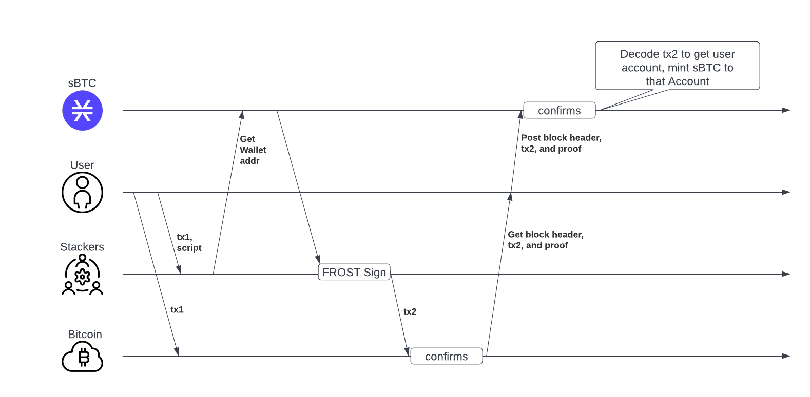

# Software Requirements Specification

### Overview of the Document

*(This document is in draft-mode presently.)*

This SRS document provides a detailed breakdown of the project requirements. The introduction covers the document's purpose and system scope. The subsequent sections present a high-level description of the product, user characteristics, and context.

Overall, this document serves as a roadmap guiding the project's design, implementation, testing, and maintenance stages.

## Introduction

### Purpose of the Document

This Software Requirements Specification (SRS) document outlines the requirements for the Liquid STX Critical Bounty. It is intended to provide a clear and concise understanding of the system's functionality, performance, design constraints, and the functional and non-functional requirements for developers, stakeholders, and end-users.

### Scope of the System

The system under development is a Liquid Stacking protocol on the Stacks blockchain. The system aims to streamline stacking STX, automatically onboard Bitcoin (BTC) rewards as sBTC, and facilitate the creation of stSTX tokens. These stSTX tokens will represent stacked STX and accrued rewards, allowing users to engage with other decentralized finance (DeFi) applications while still earning stacking rewards. Furthermore, the system will contribute to the adoption and growth of sBTC and enhance the utility of Bitcoin within the Stacks ecosystem.

## Overall Description

### Product Perspective

This project aims to build a system that simplifies the stacking of STX on Stacks by creating a liquid staking module, which will automate the onboarding of BTC rewards as sBTC using the features made available in the Bitcoin Taproot upgrade. The main components include the sBTC implementation, the P2TR script, and processes that streamline STX stacking and sBTC reward forwarding.

## **System Features**

- Liquid Stacking enables users to pool their funds and simplify STX stacking.
- stSTX Issuance representing stacked assets and accrued rewards.
- Tradable stSTX enabling new DeFI use cases for STX.
- Pooled funds: collective stacking leverages economies of scale, and increases rewards for all participants.
- Customizable protocol Stacking Strategy enabling protocol yield optimization
- PoX Rewards onboarded as sBTC.
- sBTC P2TR Script facilitates interactions between protocol PoX rewards and the Stacks peg wallet.

### User Characteristics

The system targets two main user groups: Stackers (those who deposit STX with the protocol) and Managers (those who oversee the protocol operations). Some managers are also Stackers. Users are expected to have basic understanding of cryptocurrency and staking protocols.

### Constraints and Assumptions

- The system assumes that Stacks blockchain is operational and accessible.
- The project's timeline and resources may constrain the features and capabilities implemented.
- Legal and regulatory compliance.

### Dependencies

- Successful operation depends on the functionality of the Stacks blockchain and Bitcoin blockchain.
- The sBTC implementation, STX PoX Contract, and Bitcoin Taproot are key dependencies.
- Normal protocol operation is dependent on the sBTC peg being in a ********************good state********************. If the peg is in a ******************bad state,****************** then peg-in and peg-out requests will not materialize and STX stacked by the protocol could be ******locked****** until the peg resumes normal operation.

# **Specific Requirements**

### Feasibility Analysis

The feasibility analysis aims to determine the practicality of implementing the proposed sBTC P2TR solution in terms of technical aspects and compliance. Here, we explore a high-level view of these factors.

### Technical Feasibility

**P2TR Script Implementation**: Preliminary evaluation suggests that constructing a Pay-to-Taproot (P2TR) script is technically feasible with our teams current knowledge and understanding of the Bitcoin Taproot upgrade. More in-depth research and analysis will be necessary to fully assess the nuances and complexities involved in its creation.

**Liquid Staking**: Creating a protocol for liquid staking of STX tokens is achievable with current technology and programming capabilities. 

**Onboarding BTC Rewards as sBTC**: The process of automatically onboarding BTC earned through Stacking as sBTC appears technically feasible. The primary requirement for this process is the successful development of an efficient P2TR script, which, as mentioned above, seems achievable.

## **Legal Compliance**

Legal considerations are vital for blockchain projects, particularly for the sBTC P2TR solution involving financial transactions.

- **Cryptocurrency Regulations**: The cryptocurrency regulatory landscape is complex and region-specific. Initial research indicates our operations are currently permissible, but further analysis and legal consultation are needed to ensure continued compliance and comprehensive legal understanding.
- **Smart Contracts and Securities Laws**: Certain smart contract features may fall under securities laws in some regions. We will scrutinize the P2TR script and its operations to operate within known regulatory frameworks.

In conclusion, the proposed Liquid Stacking Protocol and sBTC P2TR solution seem technically feasible and legal compliance will need to be advised by counsel to ensure the protocol functions within the boundaries of emerging laws and regulations.

## Requirement Identification

### Technical Requirements

**sBTC Rewards**

Peg-in operations are a five-step process.  This process makes use of the commit-reveal scheme proposed by Tycho and Fernando, which permits users to peg-in their BTC from custodial wallets.

The sBTC implementation depends on the successful handover of the peg wallet from one set of Stackers to the next. Failure to do so can freeze the peg and cause penalties for the current Stackers.

**Stacking STX**

PoX is implemented on the Stacks chain via a smart contract written in Clarity. Because Stacking is an action required by PoX, which is executed by Stacks miners, PoX and Stacking smart contracts are interdependent.

**************************************Registration Window**************************************

- Because our solution will act as a stacker on behalf of user’s, the system will need to register for participation in maintaining the peg during the *Registration Window.* This will be done using the `sbtc` contract.
- The registration process involves providing a *Protocol Disbursement Address* and peg wallet public keys.
- Registration can only occur during the specific period of the *******************Registration Window*******************, which starts after the PoX rewards from the previous cycle are disbursed.
- The *******************Registration Window******************* will close at a predetermined bitcoin block height (e.g. 500 bitcoin blocks prior to the start of the new cycle), and at this time, the protocol will not be able to register for the next cycle.

**************************Voting Window**************************

- After the lock-in height, but before the start of the prepare phase, there is a window of time to vote on a shared peg wallet address that will accrue BTC for all stackers. This is called the *************Voting Window.*************
- During the *************Voting Window************* (proposed to last 300 Bitcoin blocks), the protocol will be able to delegate and commit STX to a chosen wallet address (the P2TR Onboarding Script) for one cycle.

**********Transfer Window**********

- Once the *Voting Window* ends, but before the prepare phase, there is a ***************Transfer Window.*************** As a stacker of the previous cycle, the protocol will have this window of time to sign transactions to transfer peg wallet funds to the new peg wallet address that was voted on during the *************Voting Window*************.
- The length of time of the ***************Transfer Window*************** is proposed to be 100 Bitcoin blocks.

****************************Penalty Window****************************

- After the ***************Transfer Window***************, there is a Penalty Window. During this time, any user can call into the `sbtc` contract to invoke the `delegate-stack-extend` function for each of the registered stackers in the previous cycle.
- When this happens, the STX provided by the protocol will be locked for an additional cycle if Stackers’ duties aren’t fulfilled.
- The *************Penalty Window************* lasts for a proposed 100 Bitcoin blocks.

**************************************Disbursement Window**************************************

- The ****Disbursement Window**** is a precondition for opening the *******************Registration Window******************* for the next cycle. During this time, the `sbtc` contract will calculate the per-reward-slot BTC payout for each participating Stacker, such as the Liquid Stacking system, minus any penalties.
- The contract requires proof of disbursement, which can be provided in the form of one or more relayed Bitcoin transactions that encode BTC transfers from the PoX address to each Stacker’s disbursement address.
- If the stackers fail to share at least 70% of the due PoX rewards (weighted by BTC), then the registration windows for subsequent cycles will not open.
- This disbursement window happens at the start of the reward cycle, and continues indefinitely until all Stackers from the previous cycle are paid. The next registration window begins immediately after the last disbursement transaction is relayed to the `sbtc` contract.

**Stacking Strategy**

Creating a Stacking Strategy contract that aims to optimize protocol rewards involves several technical requirements. Because it is currently not possible to decrease the amount STX stacked by a single address when extending a stacking commitment, stacking would have to occur using multiple addresses and extension of stacking conditionally applied to those addresses based on withdrawal commitments.

- The strategy should account for the cycle length, minimum stacking amount, potential for auto-unlocking, and other stacking parameters.
- The strategy should be capable of utilizing off chain analysis of past Stacking data, such as rewards per cycle and average STX withdrawals per cycle, and use these off-chain calculations to inform strategic decisions. Advanced modeling could include predicting future withdrawals based on trends, variability in rewards, and number of Stackers.
- The strategy should allow for dynamic adjustments based on real-time data. This would include adjusting the amount of STX being stacked, the lock times, and conditional extension of lockups based on withdrawal commitments.
- The strategy should be modular and upgradable, allowing for continuous development on optimal strategies.

**sBTC Onboarding P2TR**

The protocol must generate a Taproot script that encodes a specific set of conditions to create an onramp for BTC rewards into sBTC, those conditions include:

- An 80-byte payload encoding the destination principle for sBTC
- A 144 Bitcoin block mining constraint for peg wallet signers' expenditure
- A spending fallback if this constraint is not met

- The use of Schnorr signatures in Taproot means new scripting opportunities and potentially more complex designs.
- Although Taproot increases transaction privacy, it may complicate the task of tracking and verifying transactions.

**Clarity**

Smart contracts written in Clarity are immutable once deployed. While this provides assurances to users about the unchanging nature of the contracts, it makes bug fixes or upgrades difficult. A robust design separating protocol logic and state will be necessary for painless upgrades.

Clarity is not a Turing-complete language, which increases security and enables decidability, but may limit the types of functionality that can be implemented directly in the smart contract.

### Functional Requirements

**sBTC Onboarding P2TR**

- The P2TR Script should facilitate the peg-in process of sBTC.
- The P2TR Script should have a fallback mechanism for protocol users if not spent by peg wallet within 144 blocks.

**STX Stacking**

Users stack desired STX into the Liquid Stacking system which takes custody of those tokens and provides users with stSTX representing a 1:1 ratio of their STX deposit.

- The system pools all of the user’s stacked STX and delegates Stacking to the sBTC contract’s decentralized stacking pool.
- The system collects PoX rewards from peg wallet and distributes rewards proportionally as outlined in the **sBTC Rewards** section through the sBTC Onboarding P2TR Script.
- Establish a warm-up period during which users must begin Stacking in order to receive rewards from the current cycle. If a user begins Stacking with the system mid-cycle, the protocol must account for this change and ensure that rewards are disbursed based on total amount Stacked at the end of the warm-up period vs. at the end of the current cycle.

**sBTC Rewards**

sBTC Rewards should be distributed amongst Stackers proportionally to the amount of STX they are Stacking within the liquid stacking pool. The following section details a model to facilitate distribution of sBTC rewards. The following model will be refined during Phase 2 of the project to account for timing of deposits.

$S_A$: Total amount of STX deposited by all users.

$s_A$: Amount of STX deposited by a particular user.

$E_B$: The total amount of sBTC rewards held by the protocol.

$\Delta{E_B}$: Change in total supply of sBTC during reward onboarding.

$H_A$: User’s balance of stSTX.

$H_B$: User’s claimable balance of sBTC.

$C_B$: Amount of sBTC rewards claimed by a particular user.

Because stSTX is minted 1:1 for each STX token stacked within the protocol, a user’s stSTX balance is:

$$
H_A = s_A
$$

During reward distribution, sBTC rewards from PoX are deposited into the Liquid Stacking contract. The balance of sBTC redeemable by a user is equal to that user’s proportional deposit of STX multiplied by the total amount of sBTC held by the contract, minus any already claimed rewards:

$$
H_B = (\frac{s_A}{S_A} \cdot E_B) - C_B
$$

During reward distribution the change in total supply of sBTC, $\Delta{E_B}$, would correspond to:

$$
r_B = k \cdot \Delta E_B
$$

Where $k$ is a constant between 0 and 1 that determines what proportion of the change in supply of sBTC is used for the reward distribution. This gives the system the ability to collect a fee when $k < 1$ in accordance with:

$$
r_{fee} = (1 - k) * \Delta E_B
$$

The user's new redeemable amount of sBTC after reward distribution is:

$$
H'_B = (\frac{s_A}{S_A} \cdot (E_B + r_B))- C_B
$$

Upon claiming rewards, $C_B$ will be updated reflecting the newly claimed rewards:

$$
C'_B = C_B + \Delta C_B
$$

Where $\Delta C_B$ is determined in line with $H_B$:

$$
\Delta C_B = (\frac{s_A}{S_A} \cdot E_B)- C_B
$$

### Non-Functional Requirements

**Security Requirements**

DeFi protocols necessitate robust security measures for asset and protocol protection in order to gain trust within the larger community, especially because attracting Bitcoin users is a primary goal of our protocol. To ensure the security of the liquid stacking system, we will conduct smart contract security audits, implement role-based access controls for protocol managers, and utilize multi-sig signing schemes for management and recovery of BTC funds in the event of an sBTC Peg outage.

### **External Interface Requirements**

**User Interfaces**:

1. **Dashboard Overview**: Users need a comprehensive dashboard that clearly shows their total stacked STX, earned sBTC rewards, and current value of their holdings to help them easily understand stacking performance.
2. **Stacking Interface**: A simple and intuitive interface is needed for users to stack their STX and manage their stacking preferences. This interface should include functionalities like `Stack` and `Unstack`, while clearly displaying the amount of tokens they can use to perform each action.
3. **Transaction History**: Users need a detailed transaction history that tracks and displays all their stacking actions and received sBTC rewards over time.
4. **Notifications/Alerts**: An alert system to notify users of any changes in the stacking pool, received rewards, or any significant price fluctuations.
5. **Help & Support**: A dedicated section for help and support, including FAQs, guides, and a way to contact support for further assistance will enhance the user experience.
6. **Language Support**: To ensure global accessibility, the user interface should support multiple languages.

**Software Interfaces**:

1. **External Wallet Interfaces**: The protocol’s website must interface with external cryptocurrency wallets that users use to hold their STX and sBTC
2. **Stacks Blockchain Interface**: The protocol needs to interact seamlessly with the Stacks blockchain via API’s and smart contract calls
3. **Price Feed Interface**: To show users the current value of their holdings, the protocol needs to interface with a reliable price feed service.

### **Requirements Traceability Matrix**

| Requirement ID | Requirement Description | Source of Requirement | Status |
|---------------|-------------------------|----------------------|--------|
| R1 | Evaluate the technical feasibility of creating a Pay-to-Taproot (P2TR) script | Project Feasibility Analysis | Done |
| R2 | Understanding of sBTC implementation | Technical Requirements | Blocked (Waiting on final designs) |
| R3 | Understanding of STX stacking | Technical Requirements | In progress |
| R4 | Understanding of Bitcoin Taproot | Technical Requirements | In progress |
| R5 | Understanding of Clarity | Technical Requirements | Done |
| R6 | Functions of Pay-to-Taproot (P2TR) script | Functional Requirements | Done |
| R7 | STX stacking and sBTC rewards onboarding | Functional Requirements | In progress |
| R8 | Performance requirements (response time, recovery time, etc.) | Non-Functional Requirements | Not started |
| R9 | Security requirements | Non-Functional Requirements | In progress |
| R10 | Liquid Staking system | System Features | Not started |
| R11 | Automatic onboarding of BTC rewards as sBTC | System Features | Not started |
| R12 | Compliance with existing cryptocurrency regulations | Compliance Requirements | Backlog |

# Glossary

**STX**: The native utility token of the Stacks blockchain.

**BTC**: Bitcoin, the first decentralized cryptocurrency.

**sBTC**: A representation of Bitcoin on the Stacks blockchain.

**stSTX**: A token representing stacked STX and accrued rewards in the Liquid Staking protocol.

**Stacking**: The process of locking STX to support the Stacks network's security and consensus. Stacking incentivizes users by enabling Bitcoin rewards.

**Liquid Stacking**: A protocol that enables users to pool their funds for STX stacking, providing liquidity and flexibility.

**P2TR**: Pay-to-Taproot, a script introduced in the Bitcoin protocol that improves privacy and efficiency.

**DeFi**: Decentralized Finance, a blockchain-based form of finance that does not rely on central financial intermediaries.

**Clarity**: A decidable smart contract language used within the Stacks ecosystem.

****************************************Registration Window:**************************************** A period for Stackers to register for peg maintenance by providing their PoX addresses and peg wallet keys using the **`sbtc`** contract. Registration must occur within a fixed time before the next cycle begins.

****************************Voting Window:**************************** A span after registration in which Stackers delegate and commit their STX to a shared peg wallet address for the following cycle.

********************************Transfer Window:******************************** A brief period post-voting for Stackers to move their previous cycle peg wallet funds to the new peg wallet address.

******************************************Penalty Window:****************************************** A time after the transfer, where Stackers can have their STX locked for an additional cycle to a burn address if they do not fulfill their duties.

********************Disbursement Window:******************** A duration beginning at the start of the reward cycle, where the **`sbtc`** contract calculates and distributes the per-reward-slot BTC payout to each Stacker, accounting for any penalties.

# **Appendix**

### References

[Mini sBTC](https://docs.google.com/document/d/1R33gZupJg0KsY-vRZYbVFwTHRmq2BCIvyPIVeY0JyGM/edit#heading=h.ajy4ix8b4u8t)

[sBTC Monorepo](https://github.com/Trust-Machines/stacks-sbtc)

[cooperative-stacking Example](https://github.com/hozzjss/cooperative-stacking)

[Boom Contracts](https://github.com/boomcrypto/boom-contracts)

[Jude Nelson's stx-future Proof of Concept](https://github.com/jcnelson/stx-future)

[BIP-340](https://github.com/bitcoin/bips/blob/master/bip-0340.mediawiki)

[BIP-341](https://github.com/bitcoin/bips/blob/master/bip-0341.mediawiki)

[bitcoinops/taproot-workshop](https://github.com/bitcoinops/taproot-workshop/)